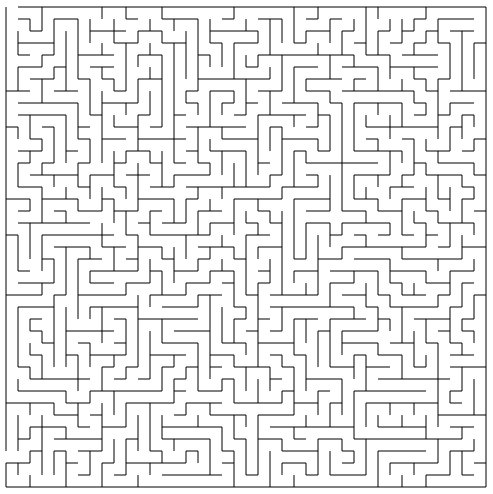

# MazeGenerator

A maze generation library in Elixir.

*An example 40 x 40 maze.*

## Features

- Generates a maze of specified width and height (in cells) using the
  Recursive Backtracker algorithm.
- Solves by creating an ingress and discovering/opening the furthest egress coordinate in the maze.
- See [Maze View](https://github.com/kbsymanz/maze_view) for an example
  application that uses the library and outputs SVG.

## Upcoming Features

- Different algorithms such as Wilson's, Hunt and Kill, etc.

## Credits

- Thank you to Jamis Buck and his book, "Mazes for Programmers: Code Your Own
  Twisty Little Passages", for the recursive backtracker algorithm.
